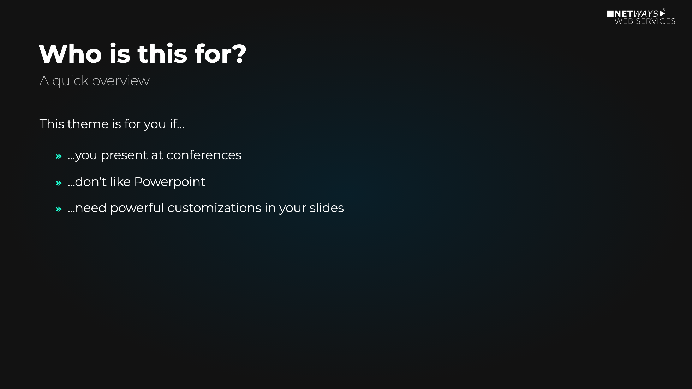
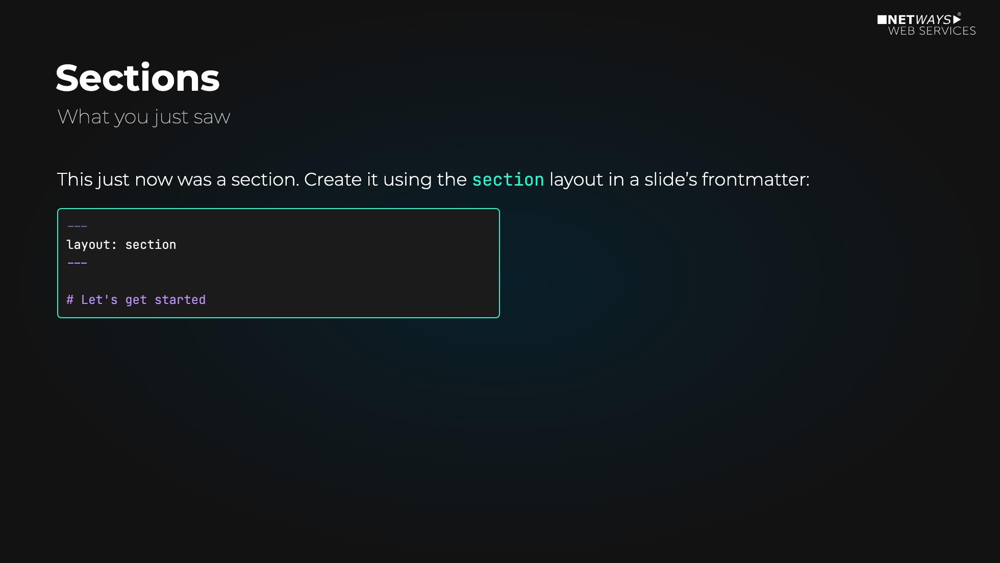
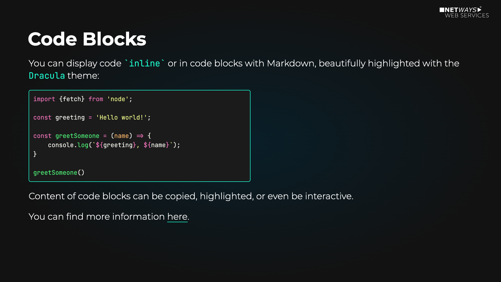
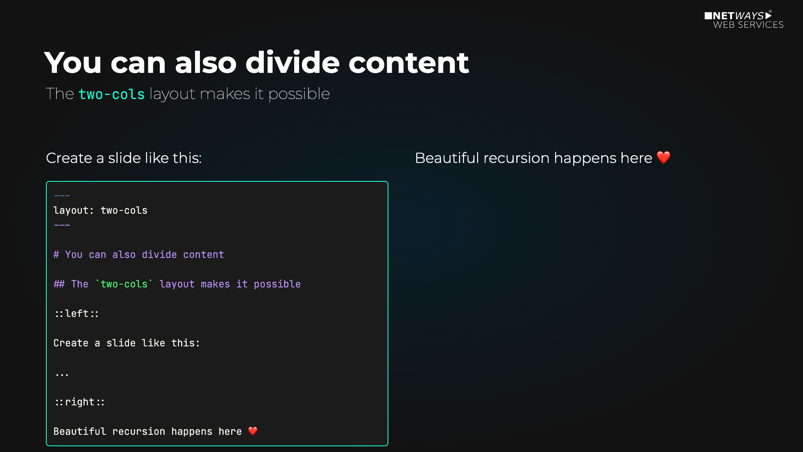
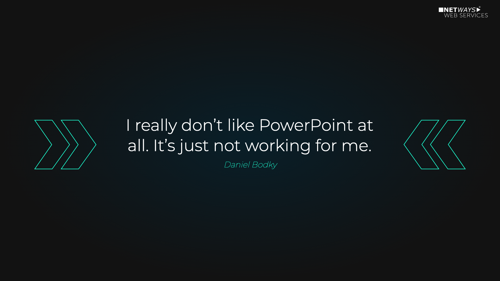
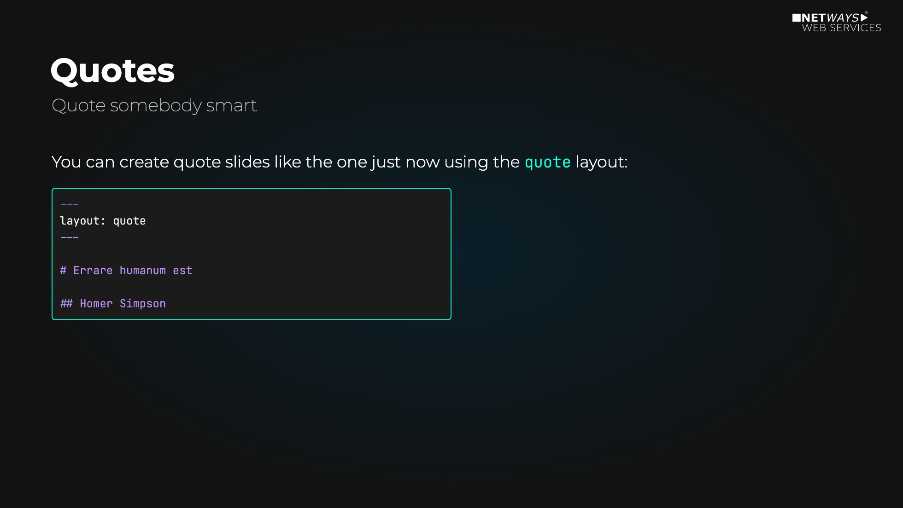

# slidev-theme-nws

The official NWS (NETWAYS Web Services) theme for [Slidev](https://github.com/slidevjs/slidev).

## Preview

<table>
  <tr>
    <td></td>
    <td></td>
    <td></td>
    <td></td>
  </tr>
  <tr>
    <td></td>
    <td></td>
    <td></td>
    <td></td>
  </tr>
</table>

## Install

### 1. Add the theme as a dependency

In your Slidev project, install the theme directly from the GitLab repository. **This requires configured access to git.netways.de via SSH key**:

```bash
npm install git+ssh://git@git.netways.de:netways-managed-services/devrel/slidev-theme-nws.git
```

Or add it manually to your `package.json`:

```json
{
  "dependencies": {
    "slidev-theme-nws": "git+ssh://git@git.netways.de:netways-managed-services/devrel/slidev-theme-nws.git"
  }
}
```

Then run `npm install`.

### 2. Apply the theme

Add the following frontmatter to your `slides.md`:

```md
---
theme: nws
---
```

Learn more about [how to use a theme](https://sli.dev/guide/theme-addon#use-theme).

## Layouts

This theme provides the following layouts:

- `cover`: Used for the presentation's cover
- `section`: Used for section headers
- `two-cols`: Allows for two columns of content
- `quote`: Used for quotes

## Contributing

- `npm install`
- `npm run dev` to start theme preview of `example.md`
- Edit `example.md` and styles to see the changes
- `npm run export` to generate the preview PDF
- `npm run screenshot` to generate the preview PNG

